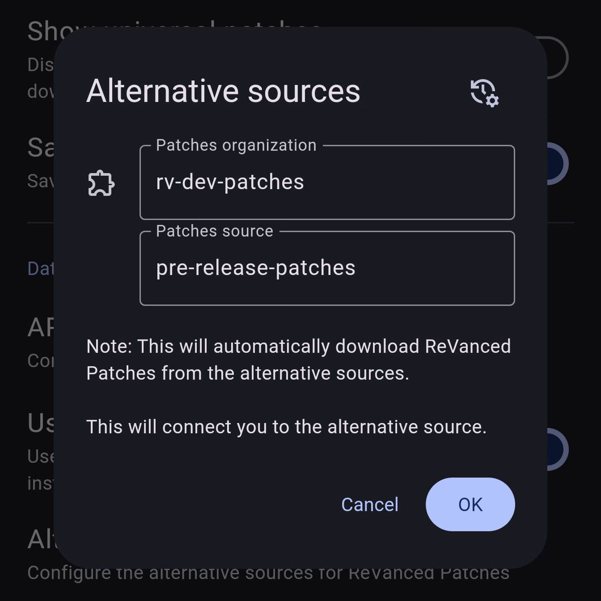

# ReVanced Pre-release Patches for Manager (Unofficial)

## 👁️ Overview

This repository allows the use of development (pre-release) patches in ReVanced Manager. The patches hosted here are sourced directly from the [ReVanced patches repository](https://github.com/ReVanced/revanced-patches) and automatically synced.

## ⚠️ Important Notes on Using Development Patches

Using development (pre-release) patches means you’re working with versions that are still in testing, so there's a higher chance of issues when applying them through ReVanced Manager. If the patching process fails or the app doesn’t work as expected, you can:

- Reset the patch source to the default in **Settings** in ReVanced Manager to revert to stable patches.
- Alternatively, you can patch the app manually using the [ReVanced CLI](https://github.com/revanced/revanced-cli) with these development [patches](https://github.com/ReVanced/revanced-patches/releases).

> [!NOTE]
> This repository is not affiliated with ReVanced and does not belong to the ReVanced team. It was created primarily for personal use.

## 🛠️ Using Development Patches in ReVanced Manager

To use the development patches from this repository in ReVanced Manager:

1. Open ReVanced Manager, go to **Settings**.
2. Toggle on **Use alternative sources**.
3. Set the following values:
   - For **Patches Organization**, enter `rv-dev-patches`.
   - For **Patches Source**, enter `pre-release-patches`.

---
